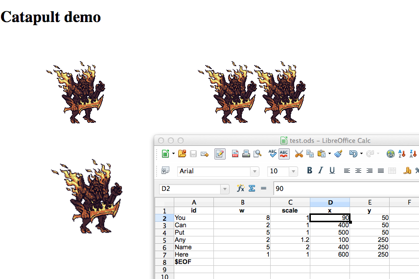

[haxe]:http://http://haxe.org
[haxe3]:http://haxe.org/manual/haxe3
[flambe]:http://lib.haxe.org/p/flambe
[wafl]:https://github.com/aduros/flambe/wiki/Wafl
[nodejs]:http://nodejs.org/
[hxods]:https://github.com/ncannasse/hxods

# Catapult: Automatic asset updater and server.

Why: decrease the game development iteration loop to be as short as possible.

How: Catapult detects changes in assets, source, and game data files, and is available to notify the game client is different ways: a pushed notification via websockets, or through http polling.

The game client can then download new assets, or perform other functions, e.g.

- Download and reload image textures so that as soon as you save a texture file your game client can reload it at runtime.
- Download parsed Json of spreadsheet data ([hxods format][hxods]).
- Reload the game client (e.g. an HTML5 game upon detection of source code change).

The main goal is to see changes in your game as soon as any change is detected for super-fast iteration.

## Installation

Build from source or install via npm (easier).

### Install via npm

	npm install catapult

Install the demo folder

	git clone --recursive git://github.com/dionjwa/catapult.git
	
And run with: 

	node node_modules/catapult/index.js --watch=catapult/demo/assets/bootstrap,catapult/demo/src

### Or Install from source:

The server is at the currently in the experimental stage and is written for [Haxe 3][haxe3], but is platform/language agnostic.  

Clone this repo and add required dependencies:

	git clone --recursive git://github.com/dionjwa/catapult.git
	cd catapult
	npm install websocket
	npm install commander
	npm install node-static
	npm install source-map-support
	haxelib install nodejs_std
	haxelib install nodejs_externs
	haxelib install format
	haxe build.hxml
	
And run with: 

	node build/index.js --watch=demo/assets/bootstrap,demo/src
	
### Using the server

In a browser, go to 

	http://localhost:8000/web/index.html
	
Then open the "test.ods" file in LibreOffice.  You can edit the x, y, and scale values, and the images will be automatically updated.

See demo/web/client.js for an example HTML5 implementation of a catapult client. 

	

Also, try these URLs in your web browser to see the data format of the asset manifests, and spreadsheet data returned:

	http://localhost:8000/manifests.json
	http://localhost:8000/bootstrap/stuff/test.ods
	http://localhost:8000/bootstrap/stuff/gamedata.ods
	http://localhost:8000/bootstrap/manifest.json
	
## Building your own client 

The catapult server is platform agnostic: you can simply poll the asset server from any client using http requests. 

Todo:

- [ ] Add some example client reloading using [Flambe][flambe].
	

